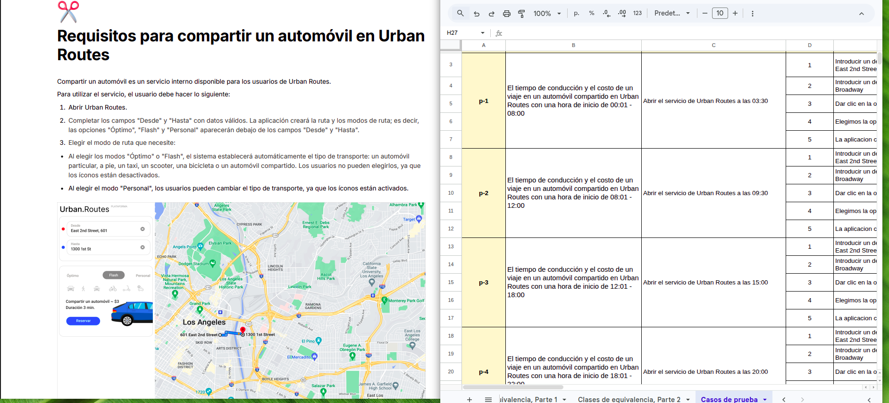

## Sprint 2: Test Design

  

## 📋 Project Description
Design and structuring of a comprehensive testing strategy for the "Car Sharing" module of the Urban Routes platform. The main focus consisted of the technical decomposition of complex requirements to guarantee full system coverage, using Equivalence Class Partitioning and Boundary Value Analysis techniques to optimize the execution of test cases.

## 🎯 Objectives

 ✅ **Visual Analysis:** Modeling of business logic through Mind Maps and Flowcharts (draw.io) to ensure requirements coverage.

✅ **Requirements Refinement:** Risk mitigation through the identification of gray areas.

✅ **Test Architecture:** Precise definition of test objects and design of optimized scenarios using Black Box techniques.

## 📂 Project Documentation

[Urban Routes Driver licence function mind map](https://drive.google.com/file/d/1eN3UNz2bE92UiQpQijxqBJRPwIQgY4CP/view?usp=sharing)

  
   
  <em>Visual Evidence: User interface for the "Add Driver’s License" field analyzed in this project.</em>

[Scenario Design: Equivalence Classes and Boundary Values](https://docs.google.com/spreadsheets/d/1wtjlU0X2UaEjEl5AguoyryblBMX-2N1B/edit?usp=sharing&ouid=115288555315603354061&rtpof=true&sd=true)

  
   
  <em>Visual Evidence: Checklist for Boundary Value Analysis and Equivalence Class Partitioning.</em>

